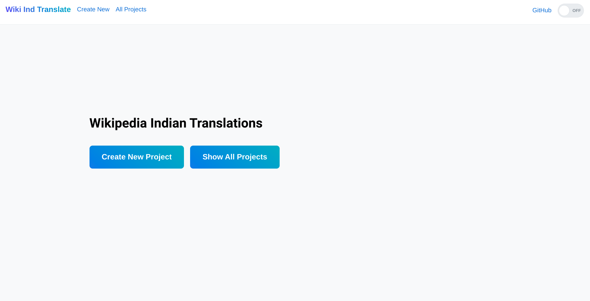
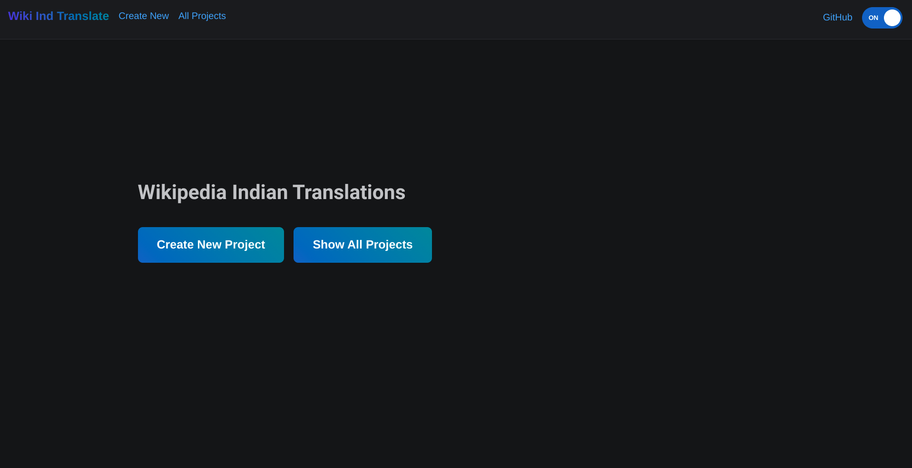

<p align="center">
  
</p>

# Wiki Ind Translate

A web app to track and store translations of Wikipedia Article Summaries in Indian languages.

## Demo

**Frontend:** https://wiki-ind-translate.netlify.app/

**Backend:** https://wiki-ind-translate.herokuapp.com/api/v1/projects

_Note: As `SQLite3` is being used as the primary database in Heroku, the saved data will be lost after a while (when the app goes to sleep)_

## Working


## Screenshots






## Run Locally

```bash
# clone the repo
git clone https://github.com/aditya-mitra/wiki-ind-translate.git
cd wiki-ind-translate
```

### Run Backend

```bash
cd server/
# create virtual enviroment
python3 -m venv venv
source
# install dependencies
pip install pipenv
pipenv install

# create the SQLite database
python manage.py migrate
# create a super user for django
python manage.py createsuperuser
# start the server
python manage.py runserver
```

Backend will be accessible at [http://localhost:8000/](http://localhost:8000/)

### Run Frontend

```bash
cd client/

# install dependencies
yarn install
# start the client
yarn dev
```

Frontend willl be accesible at [http://localhost:3000/](http://localhost:3000/)

## Tech Stack

### [Backend:](./server/Pipfile)

-   django (Main Framework)
-   djangorestframework (For creating RESTful APIs)
-   wikipedia-api (For fetching Wikipedia Summaries)
-   pysbd (For splitting summaries into sentences)

### [Frontend:](./client/package.json)

-   preact (Main Framework)
-   mantine (For creating UI components)
-   react-router (For creating client navigation)
-   react-transliterate (For typing in Indian Languages)
-   vite (For bundling)

## Authors

-   [@aditya-mitra](https://www.github.com/aditya-mitra)

## License

[MIT](./LICENSE)
